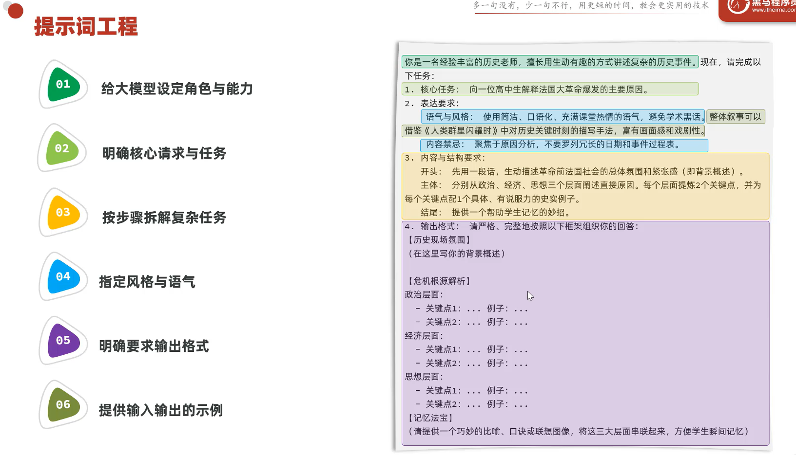

## 大模型部署方式

1. 本地部署 -- 通过如Ollama等大模型管理平台，将大模型部署到本地服务器
2. 大模型官方API -- 直接调用API将厂商已经部署好的大模型功能拿来用
3. 云部署 -- 部分云平台集成了各种大模型，通过开通平台账号付费即可使用

以上3种部署方式，在性能、成本、数据安全性上有差异，但是在开发层面上，无论哪种部署方式区别都不大。只一个人在哪个地方工作的区别而已，要做的事都一样。

---------------------------

## 大模型调用

**对话API调用 (DeepSeek)**：

- `messages` 用来表示一段对话内容。其中每一项通常包含两个字段：

  - `role`：表示这条消息是谁说的
  - `content`：表示这条消息的具体内容

**三种常见的 role**

- `system`：设定 AI 的身份和行为准则（回答风格、限制、规则等）
- `user`：用户实际提出的问题或指令
- `assistant`：AI 模型的回复 / 响应

```js
    "messages": [
      { "role": "system", "content": "你是一个简洁的AI助手，请用简短的话回答问题。" },
      { "role": "user", "content": "1+1等于几？" },
      { "role": "assistant", "content": "1+1等于2。" }
    ]
```
> 其中，`assistant`的内容是ai的回答内容，通过反复再message里存放`user`与`assistant`的内容，可以实现ai的记忆 -- 俗称滚雪球
>
> 滚雪球是ai记忆最简单实现方式
```py
  # 滚雪球示例
  from ollama import chat

  prompt = {'role': 'system', 'content': '你的名字叫Jack，是一名说话简洁的AI助理，你会尽量简单的回答任何问题'}
  memory = {'role': 'assistant', 'content': ''}
  message = [prompt]
  while True:
      user = {'role': 'user', 'content': input("用户: ")}
      if user.get('content') == '/88':
          break

      message.append(user)

      # response = chat(model='gemma4', messages=message)
      response = chat(model='deepseek-r1:1.5b', messages=message)

      memory['content'] = response.message.content

      print(f"AI助手: {response.message.content}")
      message.append(memory)
```

---------------------------

## 提示词工程

- 提示词工程示例：
  

- 图中的提示词编写步骤可以分成以下3点：
  1. 定角色 -- 设定LLM的角色和能力
  2. 给任务 -- 明确任务需求，复杂任务拆分步骤
  3. 提要求 -- 指定回答的风格，格式，提供示例

- 项目开发中，提示词并非一次性编写好的。而是不断尝试不断优化的结果