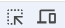

## 原始html页面解析

- 安装`lxml` --> `pip install lxml`
- 导入`from lxml import html`

**说明**：
`lxml`是一个高性能的html/xml文档解析库，支持基于`Xpath`语法来解析和获取网页数据 --> `Xpath`是一种导航或定位html/xml文档元素的`查询语言`


### 入门程序

```py
    from lxml import html

    # 读取html页面
    with open("resource/学生表.html", "r", encoding="utf-8") as f:
        # 获取html文本字符串
        html_content = f.read()

        # 解析html文本字符串，封装为html对象s -- 因为读的是字符串，所以用fromstring方法
        doc = html.fromstring(html_content)

        # 调用 xpath方法，通过xpath表达式，获取到所有精准信息
        # 获取表头
        headers = doc.xpath('//table/thead/tr/th/text()')
        print(headers)
        # 获取表体
        rows = doc.xpath('//table/tbody/tr')  # 如果不指定 text()，则会将元素内容封装成对象列表
        for row in rows:
            cells = row.xpath('./td/text()')
            print(cells)

        # 获取单行表体 -- 在 tr 处添加索引，第一行索引为1，而非0
        row = doc.xpath('//table/tbody/tr[1]/td/text()')
        print(row)
```


### Xpath语法

| 表达式            | 描述                         | 样例                  |
| ----------------- | ---------------------------- | --------------------- |
| `/`               | 从根节点开始匹配元素         | `/html/body/div/h1`   |
| `//`              | 从任意位置开始匹配元素       | `//h1`                |
| `.`               | 当前节点下匹配元素           | `./a` 与 `.//a`       |
|                   |                              |                       |
| `[n]`             | 选择第 n 个元素              | `//p[2]`              |
| `[last()]`        | 选择最后一个元素             | `//p[last()]`         |
| `[@attr]`         | 选择有该属性的元素           | `//p[@color]`         |
| `[@attr='value']` | 选择该属性值等于指定值的元素 | `//p[@color='red']`   |
| `[text()='文本']` | 选择指定文本的元素           | `//li[text()='Jack']` |
| `[.='文本']`      | 同上                         | `//li[.='Jack']`      |
|                   |                              |                       |
| `*`               | 匹配任何元素                 | `//body/div/*`        |
| `@*`              | 匹配元素的任何属性的值       | `//body/div/a/@*`     |
| `@attr`           | 匹配元素的指定属性的值       | `//body/div/a/@href`  |
| `text()`          | 获取文本内容                 | `//div/p/text()`      |

> `元素`的匹配，最后都会被封装到`对象列表`里
> `值`的匹配，最后都会被封装到`常规列表`里
> 
> `./a` 为当前节点下直接的 a 元素。 `.//a` 为当前节点级子节点下所有的 a 元素
> `[n]` 的第一个元素是 n = 1，而非传统的 n = 0
> `[last()]` 可以进行算数运算，比如`[last()-1]`
> `@attr / @*` 获取属性值的意义在于，可以获取一些img标签的图片连接

- 参考代码，用于对照语法表：

```html
    <html lang="zh-CN">

    <head>
        <meta charset="UTF-8">
        <title>仙逆人物志 - 修真世界</title>
    </head>

    <body>
        <div>
            <h1>Python</h1>
            <p>一门简介、快速、易用的编程语言。</p>
            <p>人生苦短，我用Python。</p>
            <p color="red">AI大模型开发、AI智能应用开发。</p>
            <a href="https://www.itcast.cn">黑马程序员</a>
        </div>
    </body>

    </html>
```

### 自动获取 xpath表达式的方式：

1. 浏览器F12
2. 左上角顶部栏点击`元素选取按钮`
3. 点击要爬取的页面元素，自动定位到对应的html代码位置
4. 右键选择copy，选择xpath相关


### 网页解析示例：

```py
    from lxml import html
    import requests

    # 定义url
    target_url = "https://www.tiobe.com/tiobe-index/"
    # 发送请求，获取原始网页对象
    response = requests.get(target_url)
    # 将原始网页文本封装为html对象
    doc = html.fromstring(response.text)

    # 解析原始网页
    # 获取表头
    headers = doc.xpath("//*[@id='top20']/thead/tr/th/text()")
    print(headers)

    # 获取表体
    rows = doc.xpath("//*[@id='top20']/tbody/tr")
    for row in rows:
        cells = row.xpath("./td/text()")
        print(cells)
```

