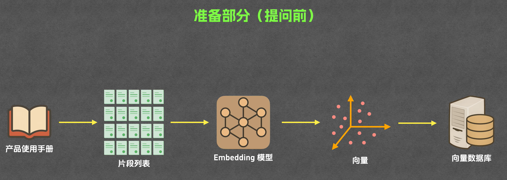
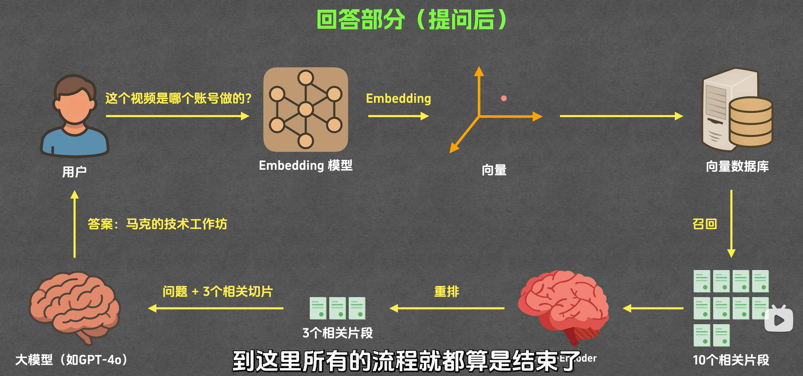
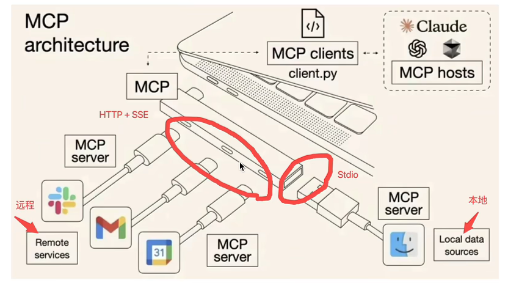
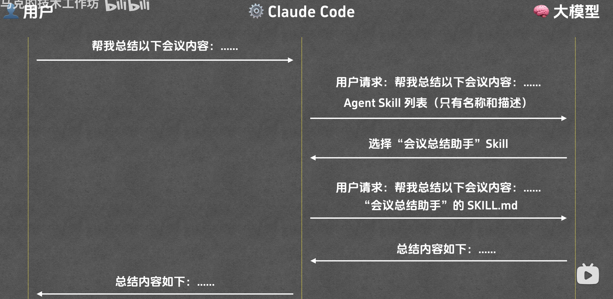

## LLM - Large Language Model

- LLM几乎都是基于2017年google团队提出来的Transformer架构而训练出来的
- Transformer出处`【Attention Is All You Need】`
- 首个可用LLM - OpenAI Chat GPT

- 主流： OpenAI，Claude，Gemini

- LLM 唯一的能力只有 **输出文本**

## Tokenizer

- Tokenizer分 编码，解码 两种模式来实现翻译职责

- **编码**：将提问者(用户)的`文字问题切片成token，并编码成数字切片token id`，传给LLM
- **解码**：LLM依据Token Id列表生成回答，并通过`将回答的token id解码成文字token`，一个一个的返还给用户

- 所以`token`，是LLM处理文本的基本单位

## Context - 上下文

- 让LLM实现记忆能力，最简单的为滚雪球法，将上下文存入字典列表中，每轮对话都将其发送给LLM，并更新

- **上下文窗口**：上下文能容量最大的token数量，主流LLM的容量大概为100万token(150万汉字)

### Rag

- 上下文处理优化技术，简单理解为在用户提问时，`Rag在用户事先提供知识库中抽取最合适的片段发给LLM`，LLM则只根据片段来回答问题。这样LLM就不用将长串的知识库放在一个上下文窗口中了。
- **知识库构建**：
- **调用库回答**：

## Prompt

- `System Prompt`：人设和做事规则，由开发者后台配置
- `User Prompt`：用户发送的消息，也就是正常聊天内容

## Tool

- LLM执行特定指令时，所需要调用的工具，通常由平台提供，因为LLM仅仅只能生成文本

- 平台为用户和LLM交互的平台，例如`ChatGpt`。而它背后的模型是OpenAI LLM

### Function Calling

- 曾经，LLM只会说话，没有调用工具的能力这使得大模型：
  1. 无法感知环境，与外部数据源交流
  2. 无法改变环境，帮用户执行任务，发邮件等
  3. 传统的平台调用API，将结果发给LLM的形式，过于hard code，并且忽视了LLM的智能特性

- 解决方案：让LLM告诉平台需要做的事，再由平台调用Tool，然后返回结果，再通过LLM输出结果

- **流程**：用户询问天气 --> 平台发送询问prompt --> LLM生成调用查询工具的代码返回给平台 --> 平台执行代码调用工具，返还结果给LLM --> LLM将结果转换为人话，再通过平台返回给用户

### MCP - Model Context Protocol 模型上下文协议

- **问题点**：`Function Calling`作为一个工具调用能力被运用，但由于不同LLM的标准不一，同样的工具需要写重复修改，以兼容API
- MCP给工具接口，接入方式定义了一个规范，只要按这个规范写，所有LLM都可以接入(类似Type-C)
- 也就是说，LLM解析prompt发送API调用指令，在曾经是不统一。如今靠统一的协议去执行同样的调用，不再需要区分不同的LLM

> Function Calling 是能力
> MCP 是规范化实现这个能力的协议

## Agent

- 根据用户prompt，自主思考，调用工具来完成用户任务的工具，比如：Claude Code、Codex、Gemini CLI

### Agent Skill

- 提前写给Agent的**说明文档**
- 通过Markdown文档的形式，描述Agent的工作规则
- 分为：**原数据层**，包括 `name` 和 `description`
        **指令层**，将任务执行规则描述给Agent

