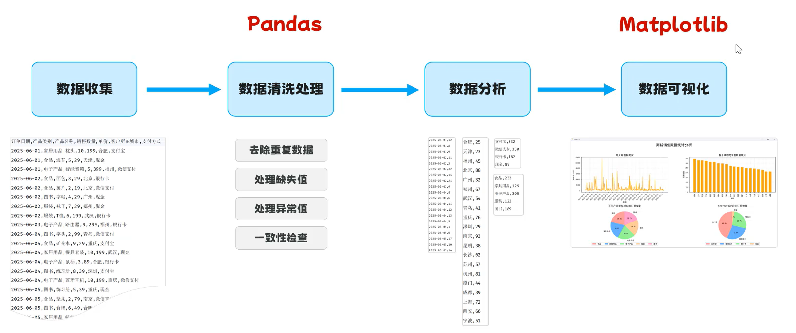
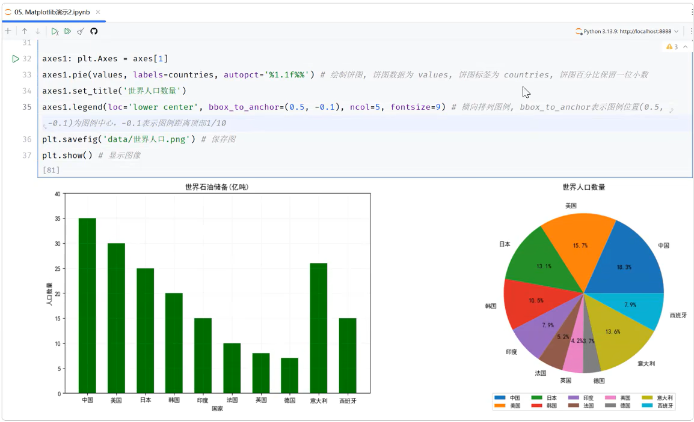

## 数据分析

从一堆杂乱无章的数据中，通过数据清洗、分析、可视化等手段，找出有价值的信息和结论。

- `数据收集` --> `数据清洗处理` --> `数据分析` --> `数据可视化`

------------------------------

### Jupyter Notebook

基于Web网页的、交互式的编程笔记本，可以把代码、运行结果、图标和笔记全部放在一个文件里

- **安装**：Pycharm直接创建 Jupyter文件

- **创建单元格**：`shift + enter`

- **运行单元格**：`ctrl + enter`

