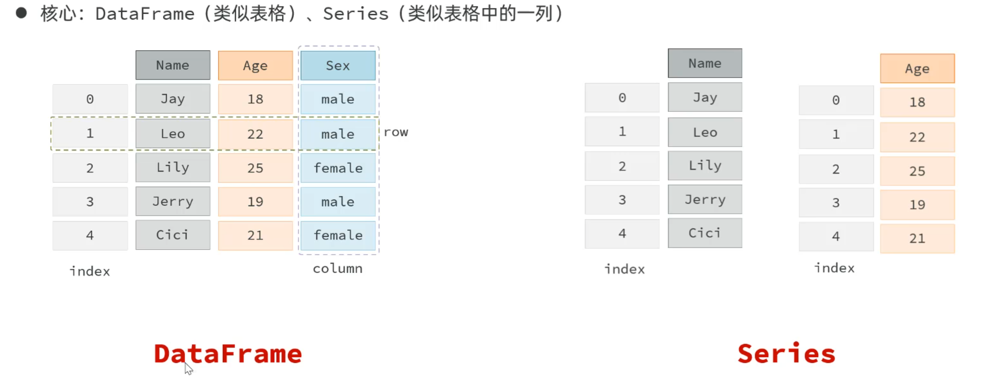

## Pandas

Pandas是一个功能强大的结构化数据分析的工具集，底层是基于Numpy构建的，数据分析、大数据开发等领域具有绝对的优势

- <a href="https://pandas.pydata.org/">官网</a>

- 核心：DataFrame(类似表格)、Series(类似表格中的一列)
  

- 安装：`pip install pandas==版本号` -- 这里用`2.3.3`

- 导包：`import pandas as pd`

-------------------------

### DataFrame

#### DataFrame的几种创建方式

- 0. **数据源拼接**
```py
df0 = pd.conct(df1, df2) or (series1, series2)
```

- 0. **读取数据源**
```py
                                             # 读取n行
df0 = pd.read_xxx("路径", usecols=[所需列名],  nrows=n)
```

- 1. **字典列表**
```py
df1 = pd.DataFrame([
    {'姓名': '张三', '语文': 90, '数学': 80, '英语': 70},
    {'姓名': '李四', '语文': 85, '数学': 95, '英语': 85},
    {'姓名': '王五', '语文': 99, '数学': 81, '英语': 95}
])
# 添加新列：
df1['总成绩'] = df1['语文'] + df1['数学'] + df1['英语']     # 与字典添加新键值对的操作一样，存在键则更新，不存在则创建
```

- 2.**字典存储列表值**
```py
df2 = pd.DataFrame({
    '姓名': ['张三', '李四', '王五'],
    '语文': [90, 85, 99],
    '数学': [80, 95, 81],
    '英语': [70, 85, 95]
})
```

- 3. **元组列表 or 列表列表 + 列名定义 + （索引定义）**
```py
df3 = pd.DataFrame([
    ('张三', 90, 80, 70),
    ('李四', 85, 95, 85),
    ('王五', 99, 81, 95)                     # 自定义索引         或者 # 将某列定义为索引
], columns=['姓名', '语文', '数学', '英语'], index=['a', 'b', 'c'] / index_col='列名')
```

#### DataFrame的常见属性与方法
```py
df1.info()  # 查看几乎以下所有列表信息：是否有缺失值，数据类型，数据量，列量等等 ⭐⭐⭐
df1.head(n) # 查看前n行数据
df1.tail(n) # 查看结尾n行数据
df1.describe() # 查看数值列的统计描述
df1.columns # 获取表头
df1.values  # 获取所有值
df1.dtypes  # 获取每列的数据类型
df1.size    # 获取单元格数量
df1.shape   # 获取行数和列数
df3.index
```
> 可以用 `.tolist()` 方法封装成列表

---------------------------------

### Series

#### Series的几种创建方式
```py
s = pd.Series([10, 20, 30, 40, 50])         # 列表创建
s = pd.Series((10, 20, 30, 40, 50), index=['a', 'b', 'c', 'd', 'e'])    # 元组创建, 自定义索引
s = pd.Series({'a': 10, 'b': 20, 'c': 30, 'd': 40, 'e': 50})            # 字典创建, 键代表索引, 值代表数据
s = df1['语文']         # 从DataFrame中提取一列数据, 作为Series
```

#### Series的常见属性
```py
s.values    # 获取Series的所有值
s.size      # 获取Series的元素数量
s.dtypes    # 获取Series的元素类型
s.index     # 获取Series的索引
s.shape     # 获取Series的行数
s.name      # 获取Series的列名 -- 前提是数据是从DataFrame中提取的一列
```
> 可以用 `.tolist()` 方法封装成列表

