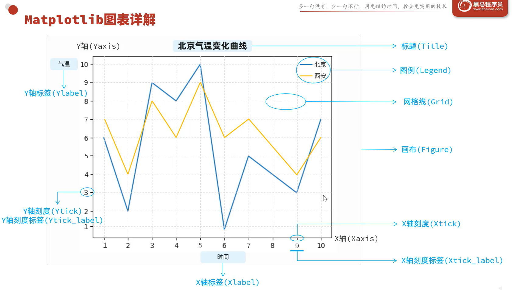
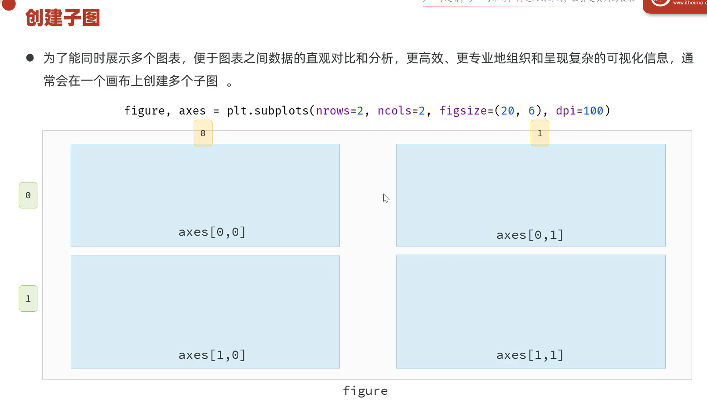

## Matplotlib

- 安装: `pip install Matplotlib`

- 导包：`import matplotlib.pyplot as plt`

- 示例
```py
import matplotlib.pyplot as plt

x = [1, 2, 3, 4, 5]
y = [6, 2, 9, 8, 10]
plt.plot(x, y)

plt.savefig("路径") # 保存统计图
plt.show()
```

--------------------

### Matplotlib构成详解 -- 折线图为例

- 折线图创建：`plt.plot(x, y)`
- 折线图构成图：
    

- 示例：
```py
import random
import matplotlib.pyplot as plt

# 图标展示中文
plt.rcParams['font.sans-serif'] = ['SimHei']

# x 为24个小时，y为温度
x = [i + 1 for i in range(24)]
y_beijing = [random.randint(10, 15) for i in x] # 北京
y_xian = [random.randint(13, 18) for i in x]    # 西安

# 创建折线图基础础架
plt.figure(figsize=(10, 5)) # 设置画布大小：宽10 高5
plt.plot(x, y_beijing, label='北京')  # 绘制折线图，图例标签为北京
plt.plot(x, y_xian, label='西安')     # 绘制折线图，图例标签为西安
plt.legend(loc='upper right')    # 显示图例，位置在右上角

# 设置折线图详细信息
plt.title('24小时气温变化')   # 标题

plt.xlabel('时间')    # x轴标签
plt.xticks(x[:])  # x轴刻度
plt.ylabel('温度')    # y轴标签
plt.yticks([i for i in range(5, 21)])   # y轴刻度

# 添加网格
plt.grid(linestyle='--', alpha=0.3)  # 添加网格：网格线样式为虚线，透明度为0.3

plt.show()
```

----------------------

### Matplotlib子图创建 -- 柱状图，饼图为例

- **柱状图创建**：`plt.bar(x, y)`
- **饼图创建**：  `plt.pie(values, labels=区块列表, autopct="%1.1f%%")` -- `autopct`为区块百分比数字显示规则

- **创建子图**：
```py
# figure: 画布对象  axes: 子图数组
figure, axes = plt.subplots(nrows=1, ncols=2, figsize=(20, 6), dpi=100)   # nrows:行数 ncols:列数 figsize:图片大小 dpi:图片分辨率
```
> `figure`: 画布对象
> `axes`:   图表数组 (存放 Axes类型数组，用于实现类似 plt方法 的操作)
> `nrows`:行数, `ncols`:列数, `figsize`:图片大小, `dpi`:图片分辨率


#### 柱状图
```py
# 子图1 - 柱状图
# 设置数据
countries = ['美国', '中国', '阿联酋', '印度', '俄罗斯', '沙特', '伊朗']
oil_reserves_2023 = [47, 26, 111, 4.5, 108, 267, 155]
oil_reserves_2024 = [44, 29, 107, 5.2, 112, 260, 159]

# 绘制柱状图
axe1: Axes = axes[0]  # 获取子图1
# 柱状图数据写入
axe1.bar(countries, oil_reserves_2023, color='w', width=0.5, label='2023年') # 绘制柱状图 x, y轴
axe1.bar(countries, oil_reserves_2024, color='y', width=0.5, label='2024年', bottom=oil_reserves_2023)
axe1.legend()   # 显示图例

# 柱状图框架
axe1.set_title("世界石油储备", fontsize=18)  # 设置标题
axe1.set_xlabel("国家", fontsize=16)  # 设置X轴标签
axe1.set_ylabel("油库（Tensor）", fontsize=16) # 设置Y轴标签

axe1.grid(axis='y', linestyle='--', alpha=0.5)  # 添加网格
```

#### 饼图
```py
# 子图2 - 饼图
# 数据设置
countries2 = ['印度', '中国', '美国', '印尼', '巴基斯坦', '尼日利亚', '巴西', '俄罗斯', '其他']
values = [14.51, 14.09, 3.4, 2.83, 2.51, 2.33, 2.12, 1.44, 20]
# 绘制饼图
axe2: Axes = axes[1]    # 获取子图2
# 饼图数据写入
axe2.pie(values, labels=countries2, autopct="%1.1f%%")  # autopct： 区块百分比数据显示规则
axe2.legend(loc="best", ncols=5, bbox_to_anchor=(1.0, 0.1))   # 显示图例，显示为5列
# 饼图框架
axe2.set_title("世界人口比例", fontsize=18)
```


