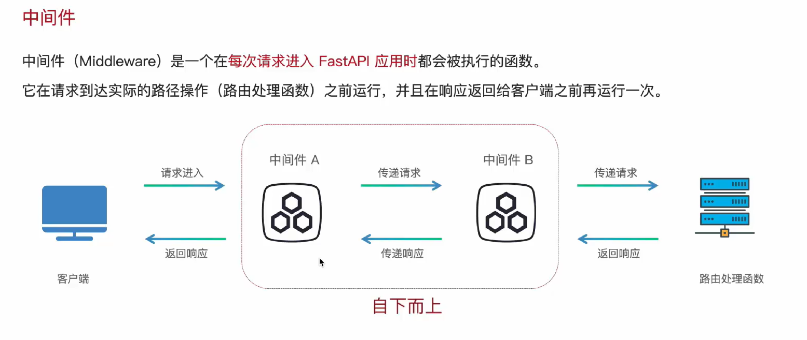

## 中间件

- 说明    ：每次请求进入FastAPI应用时，都会被执行的函数。**范围为整个接口**。
- 使用场景：需要统一处理逻辑时（记录日志，身份验证，跨域，设置响应头，性能监控）

- 执行规则：函数执行前执行一次，函数响应后再执行一次。
- 执行顺序：中间件执行顺序，自代码由下而上

- 示意图：

**使用**：
- 声名装饰器：`@app.middleware("http")`
- 创建中间件函数，书写逻辑

- 入门程序：
```py
    from fastapi import FastAPI

    app = FastAPI()

    # 中间件1
    @app.middleware("http") # 装饰器
    async def middleware1(request, call_next):
        print("中间件1 start...")
        response = await call_next(request)
        print("中间件1 end...")

        return response
        
    # 根路由
    @app.get("/")
    async def root():
        return {"message": "Hello World"}
```

----------------

## 依赖注入

- 说明    ：共享通用逻辑，减少代码重复。**范围为指定接口**。
- 使用场景：部分接口有共享逻辑时（共享数据库连接，用户权限验证）

**使用**：
- 导包：`from fastapi import Depends`
- 创建依赖函数，书写逻辑
- 指定函数的型参数处注入依赖函数：`Depends(依赖函数)`

- 入门程序：
```py
    from fastapi import FastAPI, Query, Depends
    app = FastAPI()

    # 依赖项
    async def common_params(
            page: int = Query(1, description="页码"),
            pagesize: int = Query(10, description="页大小")
    ):
        return {"page": page, "pagesize": pagesize}

    @app.get("/pages")  # 依赖项直接在形参处被注入
    async def get_pages(common: dict = Depends(common_params)):
        return common
```

> 依赖项与普通函数的区别：依赖项可以直接作为请求参数，被加入到请求中
